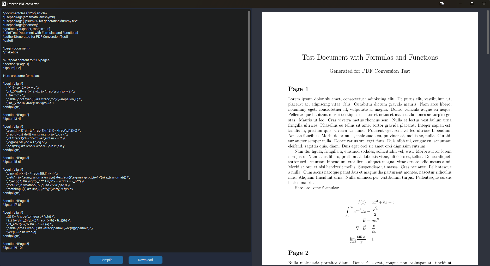

# 📄 LatexToPdf

**LatexToPdf** is a simple, cross-platform Python desktop application to convert LaTeX code into PDF with live preview, built using [`customtkinter`](https://github.com/TomSchimansky/CustomTkinter).

---

## 📦 Downloads 

**Windows**: [Download Latest Release](https://github.com/yourusername/latexToPdf/releases/latest)
**Linux**: [Download Latest `.deb`]([https://github.com/yourusername/latexToPdf/releases/latest](https://github.com/khalildim/latexToPdf/compare/v1...v1.0.1))

After download:
```bash
sudo dpkg -i latexToPdf_1.0.deb

---

## ✨ Features

- Compile LaTeX code to PDF on the fly
- Display each PDF page as an image
- Download the generated PDF
- Cross-platform support (Windows, macOS, Linux)
- Auto-detect and install LaTeX environment if missing

---

## 🖥️ Screenshots



---

## 💻 Requirements

- Python 3.9 or later
- LaTeX distribution:
  - Windows: [MiKTeX](https://miktex.org)
  - macOS: [MacTeX](https://tug.org/mactex/)
  - Linux: [TeX Live](https://tug.org/texlive/)

---

## 🚀 Installation

### 🔧 1. Clone the repository

```bash
git clone https://github.com/yourusername/latexToPdf.git
cd latexToPdf

python -m venv .venv
# Activate:
# On Windows:
.venv\Scripts\activate
# On Linux/macOS:
source .venv/bin/activate
# run the app
python env_setup.py
python main.py

